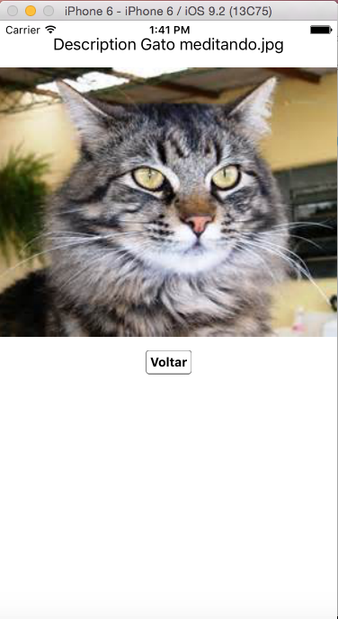

# Pesquisa de Imagens

Um aplicativo móvel escrito em JavaScript, que usa o framework React Native. Criado em um curso do [NBK Mundo Tech](https://www.youtube.com/channel/UC0leK16nPQYAErHagb8-eEg).

## Instalação

Para baixar todas as dependências:

```sh
npm install
```

Para rodar o aplicativo (iOS):

```sh
react-native run-ios
```

As vezes pode dar problema com o runtime server, dizendo que o próprio não está rodando. Para resolver o problema, abra uma tela do terminal e digite o comando:

```sh
npm start
```

## Screenshots



